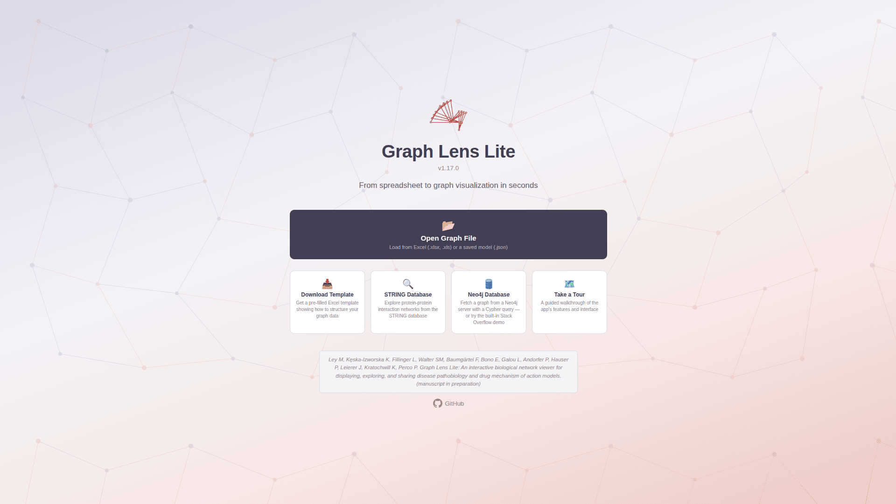
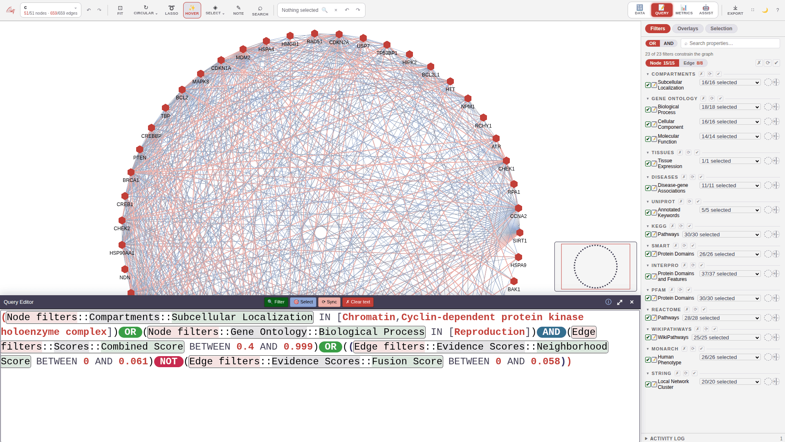
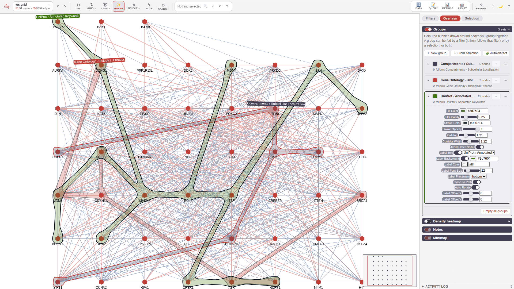
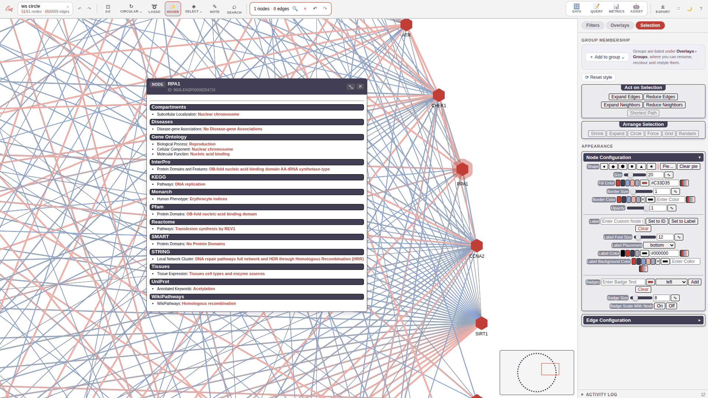
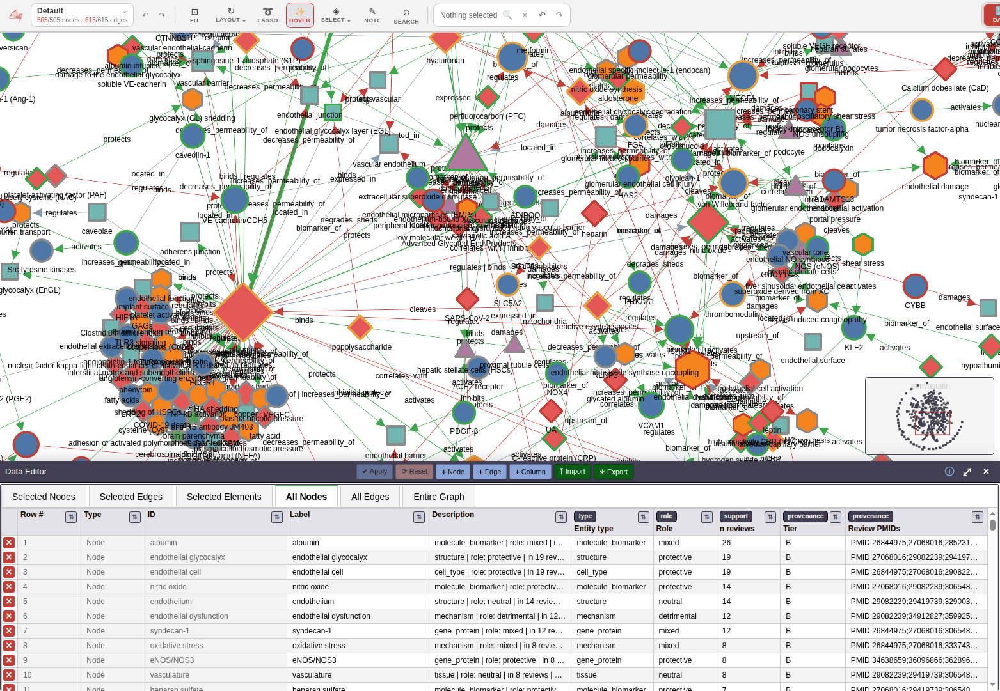
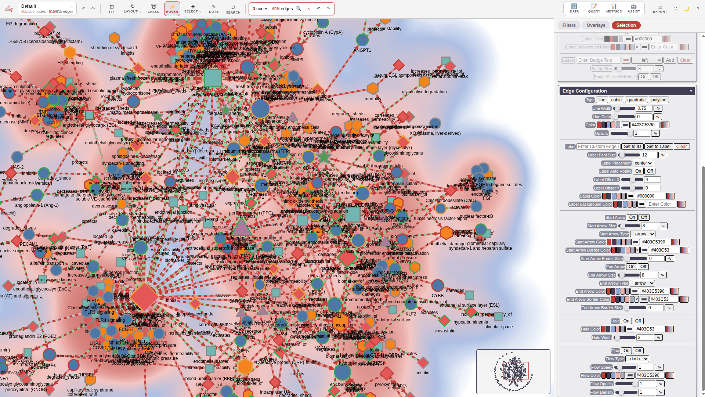
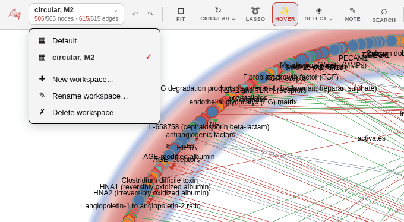
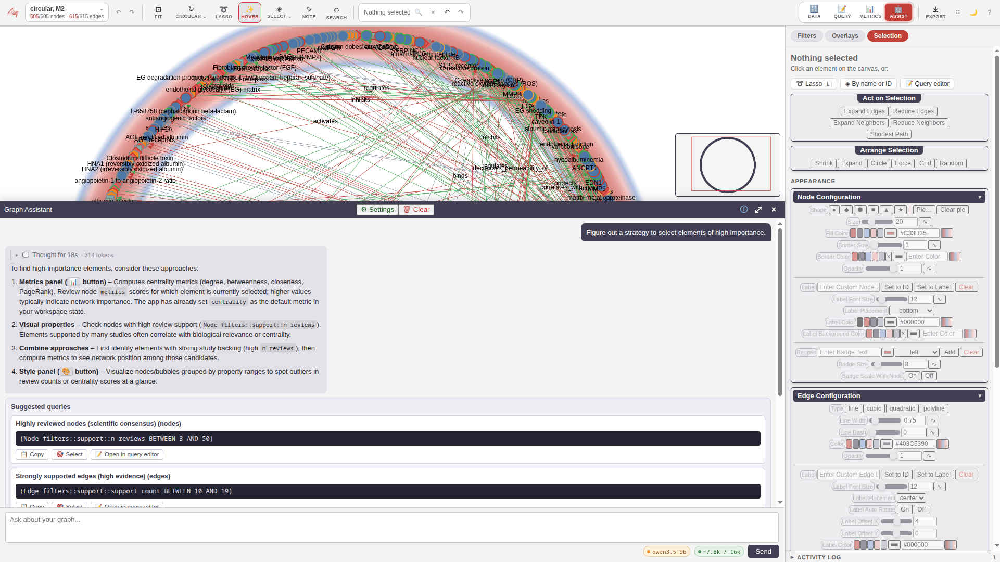
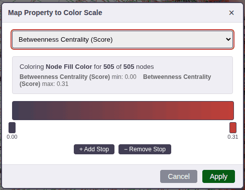

<p align="center">
  
</p>

<h3 align="center">
   Visualise and navigate property graphs through a sleek, ultra-lightweight interface.<br>
   Works in any modern browser, with native Electron desktops for Windows, macOS, and Linux.
</h3>

<p align="center">
  <a href="https://delta4ai.github.io/GraphLensLite/">🔗 Live Demo</a> · <a href="https://github.com/Delta4AI/GraphLensLite/releases/latest">📦 Latest Release</a>
</p>

## Quickstart

Download the [latest release](https://github.com/Delta4AI/GraphLensLite/releases/latest) for your platform:

| Platform | Recommended download | Notes |
|----------|---------------------|-------|
| **Web** | `graph-lens-lite_inline_X.Y.Z.html` | Just open in a browser — no install needed |
| **Windows** | `Graph.Lens.Lite.X.Y.Z.exe` | Portable — run directly, nothing to install |
| **macOS** | `Graph.Lens.Lite-X.Y.Z-<arch>.dmg` | Disk image |
| **Linux** | `Graph.Lens.Lite-X.Y.Z.AppImage` | Portable — `chmod +x` and run |

> Other formats are also available: Windows installer (`.Setup.X.Y.Z.exe`), `.deb`, `.snap`, `.zip`.

Then:
1. (Optional) Download a [template](templates/simple-template.xlsx) and add your data
2. Launch Graph Lens Lite and load a demo or your file

## Features

|                                                        |                                                                   |             |
|:-----------------------------------------------------------------------------------------------------------------------------------------:|:--------------------------------------------------------------------------------------------------------------------------------------------------:|:--------------------------------------------------------------------------------------------------------------------------------------:|
|          Open Excel or JSON files, fetch a graph straight from a Neo4j server, explore demo networks, or take a tour; zero install with portable versions          |                 Write expressive queries with boolean logic, nested conditions, and range operators to filter your graph                  | Lasso select elements, undo and redo, focus and expand neighborhoods, and group nodes visually |
|                                     |                             |                                                      |
| Filter by any property using range sliders and dropdown checklists, inspect node and edge metadata via tooltips, and navigate large graphs with a minimap | Compute centrality metrics like degree, betweenness, closeness, eigenvector, and PageRank, and edit your graph data live in a built-in spreadsheet |       Customize shapes, sizes, colors, labels, halos, badges, arrows, pie-chart nodes, animated edge flow, and bubble set appearance per element, with an optional density-heatmap overlay        |
|                                          |                                              |                  |
|                    Create independent workspaces, each preserving their own node positions, styles, filters, and bubble set groups                     |                        Ask questions in plain English — the assistant translates them into filters, queries, and styling actions                        |         Map numeric properties to continuous color gradients with configurable stops, and export graphs as JSON, PNG, SVG, or Excel         |

## Development

```bash
npm install              # install dependencies
npm run bundle:serve     # dev server with watch + sourcemaps
npm run serve            # static http-server on :8000
npm start                # electron app
npm run dist-linux       # Linux build
npm run dist-windows     # Windows build
npm run serve:api        # standalone ingest service (HTTP API + live viewer)
```

See [CONTRIBUTING.md](CONTRIBUTING.md) for the full list of npm scripts, version management, code style, and commit guidelines.

## Send data via the API

Run Graph Lens Lite as a small standalone service so other apps can push graphs to it over HTTP and watch them render live in the browser:

```bash
cp .env.example .env     # set GLL_API_TOKEN
npm run serve:api        # serves the viewer + ingest API (default :7637)
```

```bash
curl -X POST http://127.0.0.1:7637/api/graph \
  -H "Authorization: Bearer $GLL_API_TOKEN" -H "Content-Type: application/json" \
  -d '{"nodes":[{"id":"A"},{"id":"B"}],"edges":[{"source":"A","target":"B"}]}'
```

Open `http://127.0.0.1:7637/` and the pushed graph appears; further pushes update it live.

- **[SERVICE.md](SERVICE.md)** — running, configuring, and deploying the ingest service.
- **[API.md](API.md)** — payload reference for other apps: how to build JSON for meaningful graphs (styling, filterable data, bubble groups, layouts).

## Contributing

Contributions are welcome! Please read [CONTRIBUTING.md](CONTRIBUTING.md) before filing issues or submitting pull requests. See [ARCHITECTURE.md](ARCHITECTURE.md) for a map of the codebase.

## License

MIT — see [LICENSE](LICENSE) for details.

## Known Issues

1. The Query Editor cursor tends to change position on multiline queries

## Disclaimer

- Uses the [STRING](https://string-db.org/) database for demo purposes ([citation](https://doi.org/10.1093/nar/gkac1000))
- No guarantees on the accuracy of the results
- This project includes third-party software — see [THIRD_PARTY_NOTICES](THIRD_PARTY_NOTICES) for details
